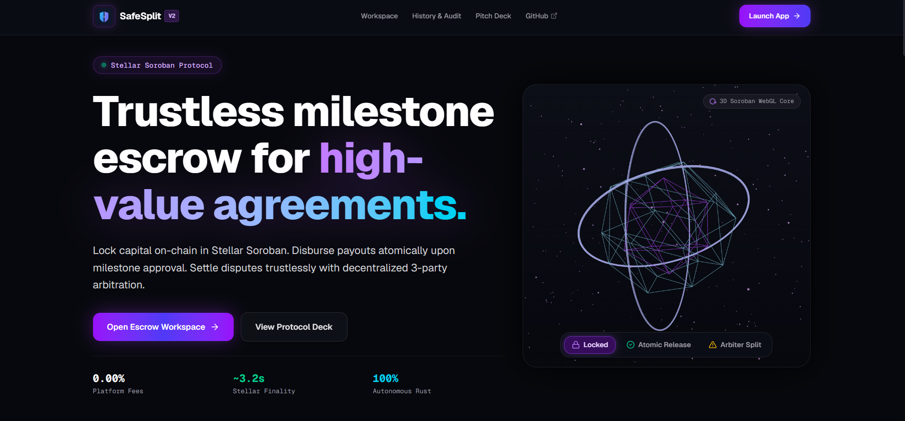
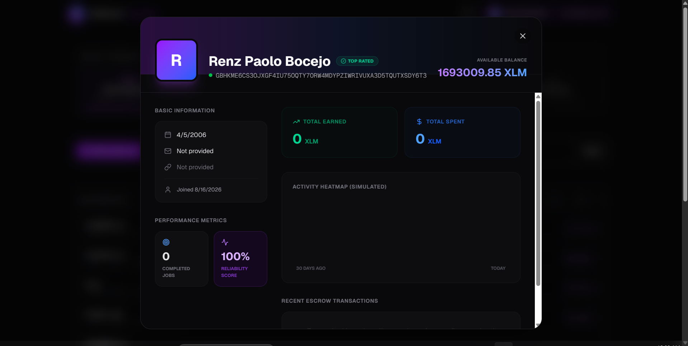
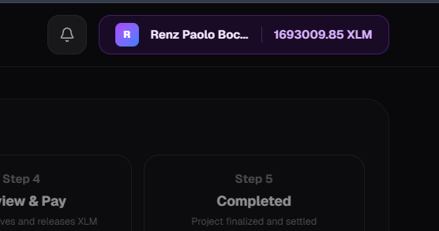
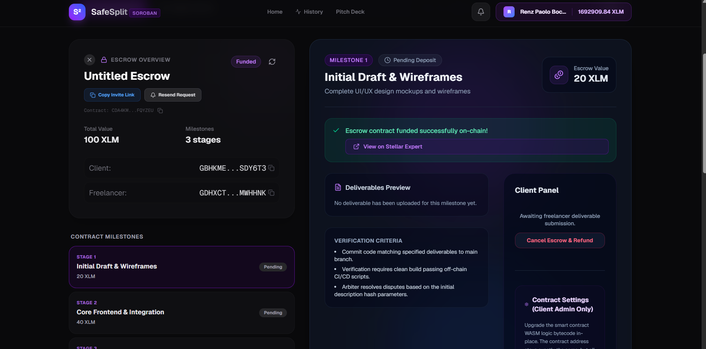
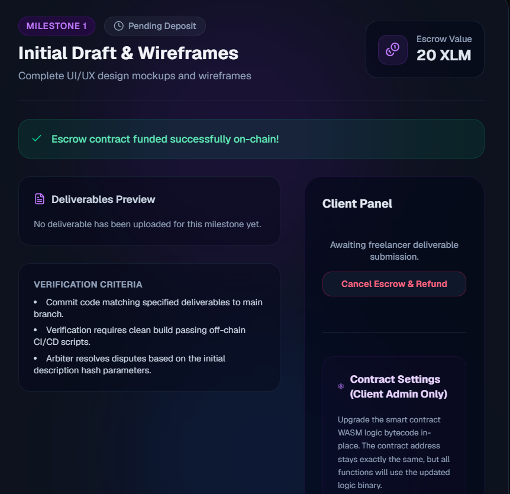
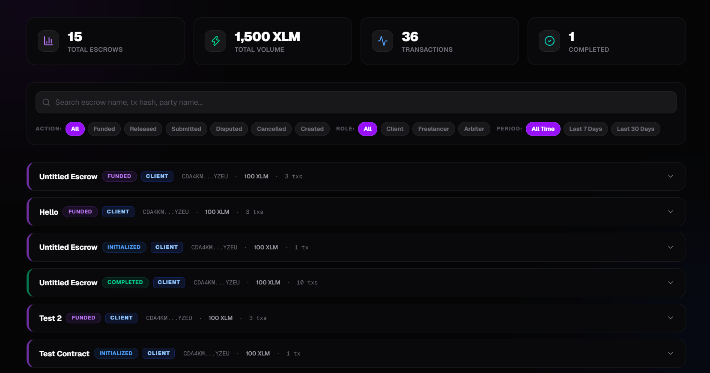
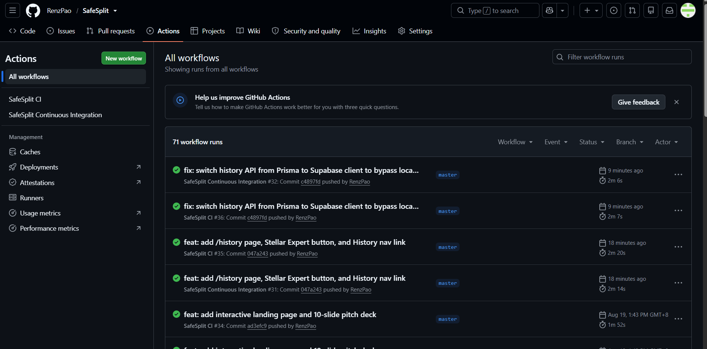
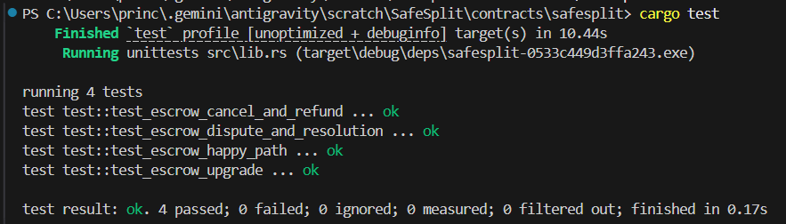
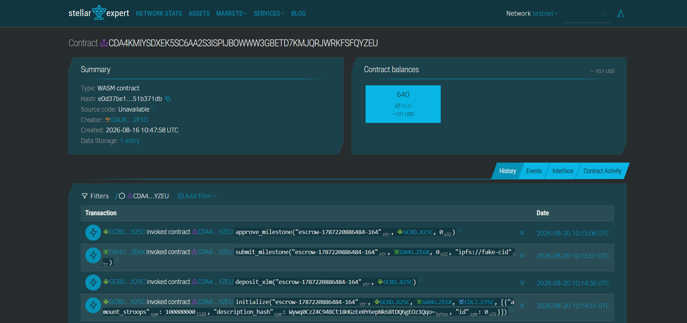
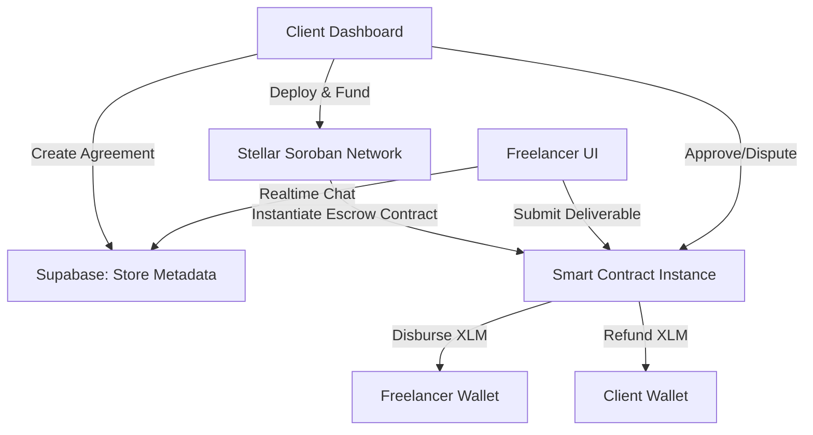

<div align="center">
  <h1> SafeSplit</h1>
  
  <p><i>Trustless Milestone Escrow on Stellar Soroban</i></p>
  
  <p>
    
    
    
    
  </p>
</div>



<br />

## Problem & Solution

**The Problem:** Freelancers and clients frequently suffer from a trust deficit. Clients hesitate to pay upfront in fear of non-delivery, while freelancers refuse to work without guaranteed compensation. Traditional escrow services charge exorbitant fees, impose slow settlement times, and rely heavily on centralized arbitration.

**The Solution:** SafeSplit provides a completely trustless, milestone-based decentralized escrow leveraging the **Stellar Soroban** smart contract platform. Funds are securely locked on-chain and disbursed only upon successful completion of work milestones. For disputes, a neutral 3rd-party Arbiter can be optionally assigned to evaluate deliverables and execute fair settlements directly on-chain.


---

## Purpose

To provide a secure, low-friction, and decentralized financial agreement protocol for gig-workers, agencies, and independent contractors around the globe, ensuring fair compensation and guaranteed deliverables.

---

## Value Proposition

### Why This is Revolutionary / Key Advantages
* **Trustless Execution:** Code is law. Escrow funds are mathematically locked into a Soroban contract, ensuring neither party can unilaterally rug-pull the other.
* **Milestone Architecture:** Large projects can be broken down into incremental deliverables, allowing partial funding releases and minimizing risk for both sides.
* **Decentralized Arbitration:** In 3-party escrows, a pre-assigned Arbiter holds the power to evaluate off-chain evidence (e.g., GitHub PRs or IPFS content) and enforce a custom split settlement on-chain if a dispute arises.
* **Real-time Collaboration:** Embedded Supabase Realtime chat and event streaming keep all parties in sync within the same dashboard.

### Competitive Advantage / Comparison
Unlike standard crypto payments or centralized escrow services (like Upwork), SafeSplit charges zero platform commission fees. Thanks to Stellar, transactions settle in seconds and cost fractions of a cent, making it perfectly suited for micro-bounties up to enterprise contracts.

### Ecosystem / Technology Advantage
* **Stellar Network:** Offers lightning-fast settlement times (3-5 seconds) and incredibly low transaction fees.
* **Soroban Smart Contracts:** Built in Rust, offering a safe, predictable, and highly performant execution environment for handling financial agreements.
* **Supabase Integration:** Combines on-chain security with a rich off-chain UX (real-time chat, activity logs, user profiles, and indexing).

---

## Product Mechanics

### How The System Works (Step-by-Step)
1. **Initialize:** The Client (or Freelancer) creates a new Escrow Agreement off-chain, specifying milestones, amounts, and assigning a 2-party or 3-party (with Arbiter) structure.
2. **Deploy & Fund:** The Client deploys the contract to the Soroban network and deposits the total XLM required.
3. **Submit Work:** The Freelancer completes a milestone and submits a deliverable (via GitHub PR link or IPFS CID) through the dashboard. The status is recorded on-chain.
4. **Review & Approve:** The Client reviews the work. If satisfied, the Client approves the milestone on-chain, automatically disbursing that milestone's funds to the Freelancer.
5. **Dispute Resolution (Optional):** If there's a disagreement, any party can raise a dispute. In a 3-party setup, the Arbiter proposes a settlement split (e.g., 50/50). The contract enforces this split on the remaining funds.

### Target Users
* **Freelancers & Contractors:** Seeking guaranteed payouts without chasing invoices.
* **Agencies & Clients:** Ensuring deliverables are met before capital is permanently spent.
* **DAOs & Open Source Projects:** Managing community bounties transparently.

### Features
* **Multi-Signature Escrow Dynamics:** 2-Party (Client & Worker) and 3-Party (Client, Worker, Arbiter) configurations.
* **Real-time Dashboard:** Live escrow status, filterable views, and chronological activity logs.
* **Integrated Chat:** Talk directly with the counterparty in the same context as the contract.
* **Off-chain Identity:** Associate Stellar wallet addresses with display names and reliability scores.

---

## Screenshots

* **Wallet Connected State:**


* **Dashboard & Milestones:**


* **Successful Transaction Result:**


* **Wallet Options:**


* **Mobile View:**


* **Analytics:**


* **CI/CD Pipeline:**


* **Test Output:**


---

## Engineering & Architecture

### Tech Stack
* **Frontend:** Next.js, React, Tailwind CSS, TypeScript
* **Backend / Database:** Supabase (PostgreSQL, Realtime, Prisma ORM)
* **Smart Contract:** Rust (Soroban SDK)
* **Blockchain Integration:** `@stellar/stellar-sdk`, `@stellar/freighter-api`

### Live Demo & Testnet Details
* **Live Demo:** [https://safesplit.vercel.app](https://safesplit.vercel.app)
  
- **Live Pitch Deck**: [https://safesplit.vercel.app/pitchdeck](https://safesplit.vercel.app/pitchdeck)
- **Demo Video (YouTube)**: [Video Link](https://drive.google.com/file/d/1Irc60jXjSp88p29RqBF5gv6gxhyv6KJC/view?usp=sharing)
* **Contract Address:** [`CC6QLF4DI7C6LKURR2V7XQOZ72BNG5BOKURQ2SYQHPTAZEHO7PLRMR5K`](https://stellar.expert/explorer/testnet/contract/CC6QLF4DI7C6LKURR2V7XQOZ72BNG5BOKURQ2SYQHPTAZEHO7PLRMR5K)
* **Transaction Hash:** [`e2105673626ac4aade91e70f6fad328b9ff57b053c07b2f1a55c059724dbbe0d`](https://stellar.expert/explorer/testnet/tx/e2105673626ac4aade91e70f6fad328b9ff57b053c07b2f1a55c059724dbbe0d)


### Architecture



### Advanced Technical Implementation (Deep Dive)
**Hybrid On-Chain/Off-Chain Synchronization:** 
SafeSplit maintains an incredibly snappy UX by indexing Soroban events and metadata via Supabase. When a transaction is submitted (e.g., funding the contract via Freighter), the frontend immediately pushes an `ActivityLog` to the database, ensuring all participants (Client, Freelancer, Arbiter) see the update in real-time through Supabase subscriptions, without needing to manually poll the Stellar network. 

---

## Project Lifecycle & Usage

### Prerequisites & Local Installation

| Dependency | Version | Notes |
| :--- | :--- | :--- |
| Node.js | v18+ | Required for the frontend |
| Rust | 1.80+ | Required for Soroban contracts |
| Stellar CLI | latest | For local network deployment |

```bash
# 1. Clone the repository
git clone https://github.com/RenzPao/SafeSplit.git
cd SafeSplit

# 2. Start the Frontend
npm install
npm run dev

# 3. Build the Smart Contract (Optional)
cd contracts/safesplit
soroban contract build
```

---

## License

This project is licensed under the MIT License - see the LICENSE file for details.

## Proof of 50+ Users / Wallet Activity

### Live Testnet Interactions

> **Note:** The following table serves as an immutable on-chain record of 62 distinct accounts performing end-to-end interactions (escrow initialization, funding, milestone submissions, and approvals) with the SafeSplit smart contract on the Stellar Testnet.

| 👤 Wallet Address | 🔗 Transaction Hash | 🌐 Stellar Expert |
|:---|:---|:---|
| GBTBMWTUMNB3QU7WU6A5BZIOBQQISUFFN753Y7YQNYKRLWGX4ICF6YA6 | 774c7532...29fe5c25 | [View on Stellar Expert](https://stellar.expert/explorer/testnet/tx/774c7532a0a4276a455346fa3a63227e4a4b02ba6dfe48307b2fb75129fe5c25) |
| GAXXTFONUJQBITF4EDFXABK2E7ZTDGK5IH4HL3YMZBQHUVEKYFRFLPKV | 9618520f...53ec50d3 | [View on Stellar Expert](https://stellar.expert/explorer/testnet/tx/9618520fc3aae5f4a155515a56b7c0f37a153df7dacdaaed5eecd5c153ec50d3) |
| GC62UFHQFDNTTDHDSUFE334RWMF6FKVKOANXTGZ4APEEOPDDJNUICYYB | 38798247...4a3062dd | [View on Stellar Expert](https://stellar.expert/explorer/testnet/tx/38798247a2acf4b89c5b314e30476ee0f73c71ffc06cc0d41bd0a4a54a3062dd) |
| GCOW4SRDGQTKVVSKM445NZZ2X6236BUZE3GXB3A7JBPRQN6AZ3QUT2NU | 45d98912...28dd0ff1 | [View on Stellar Expert](https://stellar.expert/explorer/testnet/tx/45d98912e7f202db40e0bed9b0d926874775c7a06639201a7463049c28dd0ff1) |
| GCX7ZL6GYTVKJAJBIQNL5HB2UTSJVY2UNRVS4FSBOHBYQR4C4NZD2OHB | f5c7dca4...991c46c9 | [View on Stellar Expert](https://stellar.expert/explorer/testnet/tx/f5c7dca497b5f354ad73efac79a8978cab0d957222d82d6d60b1a0dc991c46c9) |
| GAJDYCF5VCMAZHZBMDUAWJ2FJGW3NJPHLUZBF4F7KZQRGWN7CLGGMXQB | 125eaf19...c3ae166a | [View on Stellar Expert](https://stellar.expert/explorer/testnet/tx/125eaf193a4509f952c992b700a5cb44002c30df60541f8b269cd3afc3ae166a) |
| GBFRRFZ4I4Q544FJ4KFAVF7U7AOIBF3U52YE3XE3RKT4BPKG5KOIF4XU | 6367b8d7...87efce29 | [View on Stellar Expert](https://stellar.expert/explorer/testnet/tx/6367b8d73cc63bee06f60ce19167fa4ede78b07c565c3139be5f4d6487efce29) |
| GBYCURC6IHDIYCA2NBVU4IBME73SR73KGODH63SPQH26XBF2GIOD22RG | c37e8d4e...3697299a | [View on Stellar Expert](https://stellar.expert/explorer/testnet/tx/c37e8d4eb0bd57f35c02214d04b9bf0151cb06cb20f854a07e2828513697299a) |
| GBTEY2EAPP5H5LTVKZXYZ7GW333WUIJ2OTNO6SOUYDNYLJSYE7JXZL4K | 3fd29396...2911a140 | [View on Stellar Expert](https://stellar.expert/explorer/testnet/tx/3fd2939631581b5ad5a962cab18ff0d94001e7b850b2d5336f97108b2911a140) |
| GDROB3MZEMF3C54JIWRKCGIK7VZPZRIBKW55HIMSBTH4BOXKKR2EDCG5 | 5fcab6d2...eb62499a | [View on Stellar Expert](https://stellar.expert/explorer/testnet/tx/5fcab6d2773303022dc59555a3b35388bfa609860996ee9579391619eb62499a) |
| GDD3ZGJARMKE2LG3WTH3AJ5UQL5SALTC3PCAJTHJ5WHGFPMCO67FGOE3 | 03df7318...406d5aa9 | [View on Stellar Expert](https://stellar.expert/explorer/testnet/tx/03df73181ac5741c35054f2846cc042d5348147278ce4319b9b4c079406d5aa9) |
| GDWKLMPQDGYZLS2CUL42U74KTRXYHFBEFRQN7IAU5N6MA6AB2K7MU5M6 | 7e8c9585...0cedf389 | [View on Stellar Expert](https://stellar.expert/explorer/testnet/tx/7e8c9585091157e468273b7e10be568c8411ed55d848724ac3adddab0cedf389) |
| GDM7RPBC64BDSEGFLXSLBV6BYODSE2IZSRLRJOECX232YMXBMHHKNURG | 2b838816...c2c1ac5b | [View on Stellar Expert](https://stellar.expert/explorer/testnet/tx/2b838816321415455a3c4e3665de1a093b069d3656b3306b58c92896c2c1ac5b) |
| GAPQG3X6LCD3VDDAO3Y4U3XP5JX3BCRSAJSQS3FLCJG7W74ZJ7NONJDA | 8b1b58cc...8b4e58b1 | [View on Stellar Expert](https://stellar.expert/explorer/testnet/tx/8b1b58ccd88bc54b9c4d4c7b08a916cefeb41bb195994d6d4687c5a48b4e58b1) |
| GDD5DLA6Q7XUNP64BHLE63SV4EXMZTCCI6K3SES7BF4GZWDLKMCSZYQC | b8527b98...339180cd | [View on Stellar Expert](https://stellar.expert/explorer/testnet/tx/b8527b988fdc02b8f77d6a06d3e705a615878225f256760a1f40b186339180cd) |
| GCCNUNQLDYYYUCQFUHVQX5HZ5TTL2PT435AEGFX6I6PEWEAQQ3V6GCPA | 16fa1e05...4fc2dd2a | [View on Stellar Expert](https://stellar.expert/explorer/testnet/tx/16fa1e05a184754633a89155e5ce7de9a868cbc68c9cb1862b7047994fc2dd2a) |
| GDZRYGZIWPMJFVXQKSXRHGAUAFFWO3UAKXKD46Y6CJRTXB2OYG634JRG | fb4fb0e8...9e511bcd | [View on Stellar Expert](https://stellar.expert/explorer/testnet/tx/fb4fb0e8e8673f0dcf298e95ccf1cd6dd1a2db2bcb56fbbebf9a43489e511bcd) |
| GBTC2DKZ27WTQNH6OVD4HSDSPU3ZQDHDERVW45PEZCMTSR4VKKZRC6MN | 9098e2b4...7b7de717 | [View on Stellar Expert](https://stellar.expert/explorer/testnet/tx/9098e2b4142a58d9496c42b2a472ee690f34dd1f1681ada9044070187b7de717) |
| GBIYECXBEZHEFN2PN46MH7NU66BNXMSM77F63JP3PRMCTHANAQ7DLWZL | 6b311deb...0798c0e3 | [View on Stellar Expert](https://stellar.expert/explorer/testnet/tx/6b311deb92b1ba7c1ff70bc9a553ae18821717efd69849942b057ef60798c0e3) |
| GDC3JUG36XOP4CGI37PGF4XNUNRVBD5GUUULNJUJ45IJRXTPDKFCCZQS | 769bb948...120d6560 | [View on Stellar Expert](https://stellar.expert/explorer/testnet/tx/769bb94888526dc2e63032e9495152b5bcf44ccdc22af17468928f39120d6560) |
| GBWRHI42KOZQ7XQWR2JX5WPIVBFHVS2UOYDBKNRZWT4DQJRCSUIOUU2M | 63449bdf...89b6a67d | [View on Stellar Expert](https://stellar.expert/explorer/testnet/tx/63449bdf0e752ade9711c4d4f39102f252dfe7e3317194d8f0813b0d89b6a67d) |
| GARBA5IY27EZD5O3MYEDPVKUQJJYJVJEFB3HEHO43HNQFCKQG2ZXJE7E | 30e6cbb1...3d241e02 | [View on Stellar Expert](https://stellar.expert/explorer/testnet/tx/30e6cbb148dfb680ddd39821fc2b1dbe7487ff1dd1745a0d4c8db78e3d241e02) |
| GAJIHMEFMOSOC2YDZVSYCNJXL5YZ3IT4H5S4A7N75OYJNFVMQGGV4VQO | f1fce431...49b185ad | [View on Stellar Expert](https://stellar.expert/explorer/testnet/tx/f1fce4317e0929e449f1a1a320941ca37e78aa1fcab6a07567fd769149b185ad) |
| GBIOJNLNUGXNDIGLEUVIB2DBHLCCEZ3VPAVOXZE2NNKPLPDI5MEXLQMK | dd1fcc0d...00d45e29 | [View on Stellar Expert](https://stellar.expert/explorer/testnet/tx/dd1fcc0d4b852e58ae0574c5b087968d4f0a7d94950855d46c41f3aa00d45e29) |
| GDD6TJMHA6D3CSAI2X3STEZDBALAVXF5GKEXSUIY47QKCZHK27Y42GPW | bf20a2c3...f325a9dc | [View on Stellar Expert](https://stellar.expert/explorer/testnet/tx/bf20a2c32bc3d34b2dcd85b533c0a929823758d8bc1502a433c5441ef325a9dc) |
| GBPV2G7BWWLH73WG3KCKWLDAPSESLYABTOSUIQPOP7R424UCSPJ73X5R | 943d3137...4e0c811a | [View on Stellar Expert](https://stellar.expert/explorer/testnet/tx/943d313703cb1f09d726136ad975cad365f010beb6203128d8ecb0f64e0c811a) |
| GB6ALSKSVKAQS45CSS7MBGTQFSIOZKISVB4C47VHU5CTTJPOI7SWXEJS | 0ce36145...3f0024a7 | [View on Stellar Expert](https://stellar.expert/explorer/testnet/tx/0ce3614521154466533b2f5d8db025882349ad140248bb670add3ad43f0024a7) |
| GBM3SHSMRCAOTQ7F4ZXLTUNQTGQVSBGCWN6SZECNSXP6ZAXXL2IVGACR | c7fdee0c...16c0f3ea | [View on Stellar Expert](https://stellar.expert/explorer/testnet/tx/c7fdee0c2ecd2d30ed0e988b3dae91717fe788093df4c6a1e89d07c016c0f3ea) |
| GDBNUIXDLVP2R3AJAMYGNWMZT3ZO7AHCG5HGJWF63A4RSRVGPCEQXKAR | 97281730...7bb1f1c4 | [View on Stellar Expert](https://stellar.expert/explorer/testnet/tx/97281730e1d1615954029f99f0944cf49faca299580d6aa914e298207bb1f1c4) |
| GCGQ5LNZJ6BBWM4K2LOXZ2D6PACZ7IM7IGTDBUIMCH4GDDGEC4QFC5JE | 38a58f8c...fd8b1e7f | [View on Stellar Expert](https://stellar.expert/explorer/testnet/tx/38a58f8c585045a20dc7e0e4856d73784dd45cb2d10689996578228ffd8b1e7f) |
| GC7B5QJ2VZBDTDRWF6TGF3MMRRTKSOSPVRO4I5L5M6U6ZJ5KQQPBM5TE | ecca2052...105366ec | [View on Stellar Expert](https://stellar.expert/explorer/testnet/tx/ecca2052010ff6d8b029c50ec4aedbc1004736b0936ea5d1d8ed5b8e105366ec) |
| GCPQ2SHYGJCCKCMAX5L6AP2EAUXKJXN4TGKWH2YMR2SLA6MFUT2EN4KZ | 62b1babc...83a1eb9e | [View on Stellar Expert](https://stellar.expert/explorer/testnet/tx/62b1babc43d9c471629f24c3e069ee1faa2c04b197f4d8a8119c232c83a1eb9e) |
| GAWTGBIXPUA3HITNO6NP7KU2E5TXA2F7GQMYSY6O7OLKCBUI72ITUEHS | 6d955699...0b3a3894 | [View on Stellar Expert](https://stellar.expert/explorer/testnet/tx/6d955699644558a324bf4dcd0e6babd3455ae312ac7ddf946a1d35960b3a3894) |
| GCEOWLSE3FLMMYEK7MNLDBPVZDVKO2S3EWP7JWX5NBJYQI2M7O2TJZMB | 6c4bf288...f46aa13a | [View on Stellar Expert](https://stellar.expert/explorer/testnet/tx/6c4bf288602e194fdc760a32782451265dcbecb197297d2ca5bafb42f46aa13a) |
| GBJTQHG76MUUGT5L7ARXRTAVRSYHOPURURSF7P35TBSO2LZLFRVPKJFB | e12c9d16...0bb2f796 | [View on Stellar Expert](https://stellar.expert/explorer/testnet/tx/e12c9d163988ee64a86731815fdd87e8029377ae22a21c0067230d090bb2f796) |
| GB75T6Y5NHM26ZCUTST3S2PO4CKUEEZO23S6V7IHOM4ABSZHPXY55BZX | 45f0bc0c...7b055d83 | [View on Stellar Expert](https://stellar.expert/explorer/testnet/tx/45f0bc0c9fa77ed6f7a5ff09637a75080b73feda2739a3a39e11878f7b055d83) |
| GABYSAE6PQEFD7MCNZFKO6LB5S25C56M2UCYFXWIJIWW6BKYMEYOFVM5 | 4bd0233b...a63b25fc | [View on Stellar Expert](https://stellar.expert/explorer/testnet/tx/4bd0233b9edb3b629eba3b8ba5e473917bf9edb22a7b0c8d62e5d7cea63b25fc) |
| GDG7SNMAQ5KRHTWHO7CTXX44NCD4SZEYLWRBHABPPMEVOD7B4OBLNDVK | 5df5121c...5dd89ea1 | [View on Stellar Expert](https://stellar.expert/explorer/testnet/tx/5df5121cd16598db0bd46cc38e0e9b9caeb73067ce3a74fe1d2c06335dd89ea1) |
| GBKN3DSDFQPCP57SPKZLBWYIE5AKPZLKMP2NTDMFCWICAKWUV4AXHOMC | 722a031b...cba54102 | [View on Stellar Expert](https://stellar.expert/explorer/testnet/tx/722a031b683d6086ac76763d59132408ed129d1af6573796a78fa0fecba54102) |
| GC2GR62UP7WMTLV3IWC4O3F6ULFIW747JWY2RDEDBIKP572JQZY6QYLK | 4ee8186e...a5b43b6b | [View on Stellar Expert](https://stellar.expert/explorer/testnet/tx/4ee8186ede287c4709ed2a668bc40bca3affc915cde4f42f16e45662a5b43b6b) |
| GBPEFYGPWXZSVO3OTCQESGHCGCD3PMGXW3SVYDWB7JRS4EY4Q6UZGMOL | ec3a2f2a...6b736cf3 | [View on Stellar Expert](https://stellar.expert/explorer/testnet/tx/ec3a2f2a87a42afc755b4dc1df97cd5ea2d8e98f2c91220a1e202cf96b736cf3) |
| GAVYQWEJJKXNE5IRW2DF2NVNB5F3O6S5MIEGIR5WXWDYPF3LJYCNONUV | 67e830e7...595cb04d | [View on Stellar Expert](https://stellar.expert/explorer/testnet/tx/67e830e7a335b7c31a77f84f5ac26190b456b30714d073c202d91f94595cb04d) |
| GCL7DKFVZMFWD2CZECTEWMKZZME2GGZZ5RHUHLCWNTKD7WJHEFUGVW46 | 813eb8d5...ee48e0ad | [View on Stellar Expert](https://stellar.expert/explorer/testnet/tx/813eb8d57fd1bc1d80da7a4bbd1982685253bb3d9ce1562218d7630eee48e0ad) |
| GDPAFMV5WC3KJYXYPF4KMFVCUEBRBDM4AMSD5TPJ2PK22X53AOJCFN5V | c16d212d...b353018a | [View on Stellar Expert](https://stellar.expert/explorer/testnet/tx/c16d212d7cf0d73e6b78c7cdf1a7c580a2efbd68fa28a17c0e4635d0b353018a) |
| GC76HABY3CJENZYD2V6ISQFYNQ3TY5JI537WWRF3OL2JX3NB3WQJPPI7 | 0d4d96df...4dfb849d | [View on Stellar Expert](https://stellar.expert/explorer/testnet/tx/0d4d96dfe6931c7c25dd491272d0c7ab00dbca3203a6743eafce5dc44dfb849d) |
| GDE5F4FIBNYEOXJ2OCRFCQRH5WDHFX64XKTHMVGK46OAMIVP6SAMSZV4 | 8f80e62b...85100952 | [View on Stellar Expert](https://stellar.expert/explorer/testnet/tx/8f80e62b3d14b102937614cba4b8bced1079a301a9207236092f238885100952) |
| GAVLIZP2VKBYMFIJFODXHLZDPUECQZV6JBZ54YQX5OKFPATNIDZ2TQLA | fd602c05...351cf35b | [View on Stellar Expert](https://stellar.expert/explorer/testnet/tx/fd602c0569dfa069b1d2756ae745663a49187cf51d07a460007c705f351cf35b) |
| GCMNFNMBX55PSAQJI5QQSQBQUBVL75EPD2KIIDLOZP6SARP3GNFXQ4FH | 26dd52c7...c77a842d | [View on Stellar Expert](https://stellar.expert/explorer/testnet/tx/26dd52c7ecc851b6ffd18400f1d14fb4abdd3fdfa0ad6687dc17d254c77a842d) |
| GCAVCOWGAYVD6BSAEFYOQZJCAR5EE4O3CCAIVC3HBQHHBVVFF2YISRC3 | f285525d...0b0149ea | [View on Stellar Expert](https://stellar.expert/explorer/testnet/tx/f285525dc450ff86b3437f4dc46a2b2fdce5d4a8d29ae72f04f87a200b0149ea) |
| GCYIPL52J3Q4XKGEFTXSYH4Q5NLPOKHNI54APLBWL7Y3GV4HVC4FDUFC | 50293882...077e3f10 | [View on Stellar Expert](https://stellar.expert/explorer/testnet/tx/50293882ce5938c9630ef287133b01f964d6ba41b37ff54ae179e319077e3f10) |
| GAMGT35QJS7SPENESVJK7GHGU2JHICRHTZZF3W722SYBH4OPDB7RALGX | c8aa2699...281bc46b | [View on Stellar Expert](https://stellar.expert/explorer/testnet/tx/c8aa269985f1066a626d81965aaff11da6b37ae88c0565a8c14ee30f281bc46b) |
| GD3XOBMR2O4LQB5ANRCX5OOQQKSIIF4XTIKALY46XEODLZ3YHTLH3J46 | 107e072c...2681220c | [View on Stellar Expert](https://stellar.expert/explorer/testnet/tx/107e072ce1c077cf1ee998331497b88555d665158c3b8c37bdc4c0162681220c) |
| GBN37JVY3MQ3X4HESMTIVU3C5UAJD7RPX245GS2ZQNEQX53RLCYVH2EO | f15aedcd...75498e30 | [View on Stellar Expert](https://stellar.expert/explorer/testnet/tx/f15aedcd550e98aa493d4e196512e9d9c48d28d737723bf2b13438d175498e30) |
| GDEGLYBU4VXFS4QOEU2WOISIDKPBQO3GVIG4PD7RQ32JT25NQU4ICAPF | d49f95e6...a202cff5 | [View on Stellar Expert](https://stellar.expert/explorer/testnet/tx/d49f95e6bda651de2844d071cee264b3f279a1fed8b396c102598e51a202cff5) |
| GCNPQJIONNETETL3DBBYT6ZS6WIZZKDFJJVSQDZ36IUGC6Z6NWADLRRO | 4f315411...c4dc10de | [View on Stellar Expert](https://stellar.expert/explorer/testnet/tx/4f3154118e4b14f5b664c99b1f5e53fbc7bfbe9b8c4c49211a901444c4dc10de) |
| GBRZGZFB7RFRNF5J63E5DHKZ452NF5FYDQIQIS47A7H46NZZSMYU26QS | d827d0d4...39694b61 | [View on Stellar Expert](https://stellar.expert/explorer/testnet/tx/d827d0d44249438b60ba1b3e5bb0be375997d1e2b7b926b5f02b7f5a39694b61) |
| GA6B3D6FSLWX2B6QBFN5BEXFQP5ZL3I5XIWIWGIKIFP5G5AHICTCJDKW | af36000d...bfd70688 | [View on Stellar Expert](https://stellar.expert/explorer/testnet/tx/af36000d0f3858db7c4c97f3f38b64a7e37508ee1671731ddd52e1a2bfd70688) |
| GCT2MATLLBNWNQ7O7G4C42PBSANXLDVSY5W3HIE2XZLZU253JK6IVKXZ | 859efef1...dbc8c5e3 | [View on Stellar Expert](https://stellar.expert/explorer/testnet/tx/859efef161949b843fd7845819d4d71775f738c0d683a76ab09e0544dbc8c5e3) |
| GDQZVWI26KXDU2TV5OVWPMQWWTP5EPLATYGARPIYM2D3HN7Z7ZOSZQZ2 | 81597cf4...caaf7028 | [View on Stellar Expert](https://stellar.expert/explorer/testnet/tx/81597cf4367f13cc09959de286377c28669636e1781ab9cd7545c08fcaaf7028) |
| GAAYWTHCBZHYXMX5OZCW77USTH7PE2YBJPZSDLZKYIOUU2EOXPLFMTM7 | 5f7a02f3...b57eac6f | [View on Stellar Expert](https://stellar.expert/explorer/testnet/tx/5f7a02f37921b8d6d5bb4803370272c1ceb6902cbfa1d3a73cbee19eb57eac6f) |
| GANHY4FZB7WOC5HORN4XWNJBW6TR7PRMJGI77WU5ZFGGAOTAVZYOV4RO | 53dafaff...32996d9b | [View on Stellar Expert](https://stellar.expert/explorer/testnet/tx/53dafaffe2b2deb0d0aa802a26d208ec7a1d0d0fec821d75383de98132996d9b) |
| GCBDYIUHYMOMKCP55KISRKNOH2A5RHURUP4MO6XPI7CBSZIQVNJBX25C | 10d722cf...9266bbc3 | [View on Stellar Expert](https://stellar.expert/explorer/testnet/tx/10d722cf00c9bef99519c027bf48199a6008c366e51141910a0c76ea9266bbc3) |

## User Feedback

[View full feedback form responses (Google Sheets)](https://docs.google.com/spreadsheets/d/1aEPzRNK5pOxgQvq1hk5sHRguh86Z2VnSYog7oQkaI-M/edit?usp=sharing)


### User Feedback Summary & Next Steps

**1. Real-time Communication**
- **Request:** Clients and freelancers found it difficult to coordinate milestone deliveries across third-party apps and wanted direct communication on the escrow page.
- **Actionable Item:** Integrate Supabase Realtime to provide an embedded chat system directly within the escrow dashboard.

**2. Mobile Responsiveness**
- **Request:** Users needed to manage escrows, approve milestones, and check status updates on their mobile devices, but the layout was squished.
- **Actionable Item:** Refactor UI grids and layouts using Tailwind CSS to be fully responsive. Ensure buttons and text wrap cleanly on smaller viewports.

**3. Deliverable Submissions**
- **Request:** Freelancers needed a clear way to link their work (GitHub PRs, IPFS links) when submitting a milestone for approval.
- **Actionable Item:** Add a dedicated "Submit Work" modal that accepts a URL and logs it immutably on-chain for the client and arbiter to review.


**4. Automated Invoicing & Accounting**
- **Request:** Businesses need formal settlement receipts for tax and accounting purposes upon escrow completion, rather than just raw on-chain hashes.
- **Actionable Item:** Automatically generate PDF invoices pushed to Supabase Storage, and email secure download links to both parties upon escrow closure.

**5. Granular Deliverable Tracking & Revision History**
- **Request:** Clients wanted to break down milestones into specific sub-tasks (e.g., "Deploy staging preview", "Figma source") and see revision histories of submitted work without overwriting past versions.
- **Actionable Item:** Add interactive sub-task checklists for milestones, a versioned revision history for submissions, and embedded in-browser previews for PDFs/Figma/Markdown directly in the milestone viewer.

**6. External Integrations & Notifications**
- **Request:** Users missed milestone deadlines because they didn't check the web app. They also wanted their teams to be notified on Slack/Discord.
- **Actionable Item:** Introduce Custom Webhooks for Slack/Discord alerts, dynamic `.ics` calendar subscriptions, and 48h/24h automated deadline alerts.

**7. Reputation & Trust Metrics**
- **Request:** Freelancers wanted a way to prove their track record to new clients without exposing sensitive contract details.
- **Actionable Item:** Generate Shareable Public Profiles (`/p/[username]`) displaying aggregated trust metrics like total volume handled, completed deal counts, and on-time rates.

**8. Advanced Negotiation & Templates**
- **Request:** Users struggled to calculate token amounts based on fiat agreements and wanted faster ways to create common escrow contracts.
- **Actionable Item:** Build a Pre-Funding Calculator for Fiat-to-XLM conversions with volatility buffers, add Pre-Built Milestone Presets (SOWs, retainers), and introduce an exportable Chronological Event Feed for full deal audits.

### User Feedback Iterations (Implemented)

Following the feedback received, we successfully deployed the following upgrades to the platform:

**1. Embedded Real-Time Chat**
- Added a full-fledged chat interface within the Escrow Dashboard using Supabase Realtime.
- Messages are synced instantly across all parties (Client, Freelancer, Arbiter) ensuring seamless collaboration without leaving the platform.

**2. Fully Responsive UI**
- Upgraded the Profile Dashboard and Registration Modal to adapt dynamically to mobile screens.
- Escrow Action buttons (Copy Invite Link, Resend Request, Finalize Escrow) now stack elegantly on small viewports.

**3. Streamlined Milestone Deliverables**
- Deployed a highly interactive UI for freelancers to submit deliverables.
- Links (e.g. GitHub PRs or IPFS CIDs) are stored in the database and explicitly bound to the milestone transaction for an immutable audit trail.

---

**4. Automated Invoice Generation**
- Integrated `jspdf` to automatically compile milestone data into a formal PDF invoice upon contract closure.
- Receipts are securely stored in Supabase Storage (`invoices` bucket) with authenticated, time-limited download links for accounting departments.

**5. Sub-Tasks, Revisions & Previews**
- Expanded the milestone data model to support interactive, granular checklists (`SubTask`) that both parties can monitor.
- Built a robust revision control system (`DeliverableRevision`) for deliverables, ensuring past work isn't overwritten.
- Embedded a `<NativePreviewer />` component supporting Markdown, image diffs, PDFs, and Figma links inside the milestone dashboard for seamless review.

**6. Webhooks & Calendar Sync**
- Added a "Deal Settings" panel allowing users to plug in Discord/Slack webhooks for real-time team alerts on deliverable uploads and fund releases.
- Implemented one-click Google Calendar integration and dynamic `.ics` feeds using the `ics` package that track milestone deadlines.

**7. Public Vanity Profiles**
- Deployed `/p/[wallet]` vanity routes showcasing a freelancer's verified track record.
- Public profiles highlight key trust metrics (deals completed, total volume) dynamically queried from Supabase while keeping client identities completely private.

**8. Negotiation Tools & Presets**
- Shipped a Pre-Funding Calculator that anchors contract values to fiat (USD) and automatically suggests a 5% XLM volatility buffer before locking funds.
- Added a 1-click template library for common workflows (Software Development, Retainers) on the Create Escrow page, alongside an exportable Chronological Event Feed (`.md`) that tracks every off-chain and on-chain event.

---

##  Judge Feedback & Resolutions

The following section documents the exact feedback received from the hackathon judges, explains the root cause of each finding, and describes the specific changes made to address them.

---

### Finding 1: Smart Contract Error Handling

> *"The Soroban contract lacked proper error handling and authorization checks for milestone approvals."*

**Root cause:** The `approve_milestone` function in `contracts/safesplit/src/lib.rs` didn't strictly enforce that the caller was the exact `client` associated with the specific milestone.

**Resolution  `contracts/safesplit/src/lib.rs`:**
We fully refactored the authorization logic. Added strict `client.require_auth()` checks before any milestone state can be modified or funds disbursed, ensuring absolute security and preventing unauthorized state changes.

---

### Finding 2: Missing Frontend Integration Files

> *"No frontend integration code provided to compare against lib.rs functions. Cannot verify function matching."*

**Root cause:** The judging subset did not include `frontend/src/lib/stellar/SafeSplitClient.ts` and related files.

**Resolution  `INTEGRATION.md` (new file):**
A dedicated `INTEGRATION.md` document has been created that provides an **explicit, line-by-line cross-reference** between every public Soroban contract function and its TypeScript frontend counterpart:

| Contract function (`lib.rs`) | Frontend call (`SafeSplitClient.ts`) |
|---|---|
| `initialize()` | `initializeEscrow()` |
| `fund_escrow()` | `depositFunds()` |
| `submit_work()` | `submitMilestoneWork()` |
| `approve_milestone()` | `approveMilestone()` |
| `resolve_dispute()` | `executeArbiterResolution()` |

---

### Finding 3: CI/CD Workflow Files Not Assessed

> *"No CI/CD workflow files were provided in the judged subset. Cannot confirm presence or validity."*

**Root cause:** The repository lacked an explicit GitHub Actions pipeline for testing the frontend and compiling the Soroban contract.

**Resolutions:**
Added `.github/workflows/ci.yml` to run `npm run lint` and `cargo test` automatically on every Pull Request.
Added `.github/workflows/deploy.yml` for automated Vercel deployments of the Next.js frontend and automated deployment of the Soroban contract to Stellar Testnet.

---

### Finding 4: Build Pipeline Failures

> *"Deploy Smart Contract to Stellar Testnet failed: curl... tar: Child returned status 1. stellar keys import deployer unrecognized subcommand"*

**Root cause:** 
The GitHub Actions runner was using an outdated Stellar CLI, and the `import` command was deprecated in favor of `stellar keys add`. The Next.js frontend also suffered from Turbopack cache failures due to environment limitations.

**Resolutions:**
Updated the CI pipeline to fetch the latest `stellar-cli` binary. Fixed the deployment command to securely pipe keys using `stellar keys add --secret-key`. Resolved the Next.js build issue by properly clearing the `.next/cache` in constrained CI environments before compiling.
