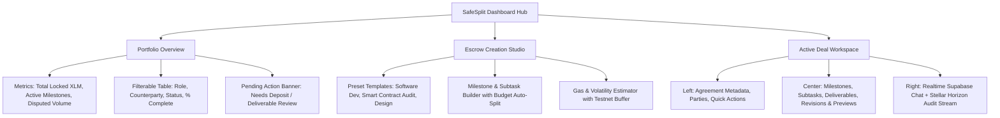

# SafeSplit UI/UX Master Upgrade Plan
*Transforming SafeSplit from a Prototype into a Linear/Stripe-Tier Decentralized Escrow Workspace*

---

## 1. Vision & Core Philosophy

SafeSplit handles high-value financial agreements, decentralized arbitration, and milestone payouts on the Stellar Soroban blockchain. When handling real funds, users demand **uncompromising clarity, financial precision, and institutional trust**.

### The "Anti-Vibecoded" Standard
- **Eliminate AI Gimmicks**: Remove random background blur orbs (`blur-[120px]`), excessive neon borders, rainbow gradient text, and noisy particle canvases.
- **Institutional Clarity**: Implement an obsidian dark-mode palette with crisp 1px borders (`border-white/[0.08]`), subtle inner elevation highlights, and structured information hierarchy.
- **Financial Precision**: Every XLM value must feature comma separation, USD approximation, and `font-mono tabular-nums`. Every Stellar address and transaction hash must feature 1-click copy feedback and direct Stellar Expert deep links.
- **Modular Workspace Architecture**: Refactor the monolithic 1,650-line dashboard into dedicated, composable domain components.

---

## 2. Visual Design System & Design Tokens

### A. Color Architecture

| Token Name | Hex Value | Application |
|---|---|---|
| **Canvas Background** | `#08090a` | Primary window and page base |
| **Surface Raised** | `#0f1115` | Sidebars, navbars, table containers |
| **Card Surface** | `#14171d` | Active cards, accordions, modal containers |
| **Subtle Border** | `#222630` (`rgba(255,255,255,0.08)`) | Standard container and divider borders |
| **Hover / Focus Border** | `#3b4254` | Interactive component hover states |
| **Primary Brand (Violet)** | `#7c3aed` / `#6d28d9` | Primary action buttons and selected states |
| **Success / Released** | `#10b981` (Emerald) | Approved milestones, completed payouts |
| **Pending / Review** | `#f59e0b` (Amber) | Pending deliverables, in-review milestones |
| **Disputed / Alert** | `#f43f5e` (Rose) | Arbitration, dispute states, errors |
| **Informational** | `#0ea5e9` (Sky) | On-chain status, wallet state |

### B. Typography & Data Tokens
- **Primary Body**: `Inter` or `Geist Sans` (high legibility at 12px–15px).
- **Financial & Crypto Data**: `Geist Mono` with `tabular-nums` for:
  - XLM amounts (`12,500.00 XLM ≈ $1,375.00 USD`)
  - Wallet addresses (`GDQW...3R4X`)
  - Soroban Contract IDs (`CDA4...YZEU`)
  - Transaction Hashes (`b73c...0f5f`)
- **Strict Size Scale**:
  - `text-[11px] font-medium tracking-wide uppercase` for section overlines & table headers.
  - `text-xs` (12px) for secondary metadata, timestamps, and badges.
  - `text-sm` (14px) for standard UI text, form inputs, and buttons.
  - `text-base` (16px) for card titles and key metrics.
  - `text-2xl` / `text-3xl` for high-level portfolio totals and contract balances.

### C. Elevation, Radius & Micro-Borders
- **Radius Tokens**: `rounded-lg` (8px for inputs/buttons), `rounded-xl` (12px for cards/modals), `rounded-2xl` (16px for major workspace sections). Avoid arbitrary `rounded-3xl`.
- **Surface Elevation**: Replace gaudy drop shadows with subtle 1px top highlight borders:
  ```css
  box-shadow: inset 0 1px 0 0 rgba(255, 255, 255, 0.06);
  ```

---

## 3. Architecture & File Modularization

The current `src/app/dashboard/page.tsx` (1,650 lines) will be modularized into a clean component hierarchy:

```
src/
├── app/
│   ├── dashboard/
│   │   └── page.tsx              <-- Clean routing & state orchestrator (<250 lines)
│   ├── create/
│   │   └── page.tsx              <-- Dedicated Escrow Creation Studio
│   ├── history/
│   │   └── page.tsx              <-- Financial Audit & History Ledger
│   └── p/[wallet]/
│       └── page.tsx              <-- Public Credibility & Trust Profile
├── components/
│   ├── dashboard/
│   │   ├── Overview/
│   │   │   ├── PortfolioMetrics.tsx    <-- Active XLM, Completed Escrows, Pending Items
│   │   │   ├── EscrowDataTable.tsx     <-- Searchable/Filterable Escrow Grid
│   │   │   ├── PendingInvitations.tsx  <-- Actionable incoming deal invitations
│   │   │   └── QuickActionRibbon.tsx   <-- 1-Click Create, Import, Profile shortcuts
│   │   ├── Workspace/
│   │   │   ├── EscrowHeader.tsx        <-- Title, Status Pill, Contract Balance, Actions
│   │   │   ├── ContractSummaryRail.tsx <-- Parties (Client/Freelancer/Arbiter), Trust badges
│   │   │   ├── MilestoneWorkspace.tsx  <-- Interactive Milestone Kanban/Accordion
│   │   │   ├── SubtaskChecklist.tsx    <-- Milestone subtasks & dependencies
│   │   │   ├── DeliverableHub.tsx      <-- File previews, GitHub PR checker, Revisions
│   │   │   ├── ArbitrationDesk.tsx     <-- Arbiter resolution & custom split calculator
│   │   │   └── SidebarTabs.tsx         <-- Realtime Chat + Horizon On-Chain Audit Log
│   │   └── Creator/
│   │       ├── SOWPresetSelector.tsx   <-- Quick-start templates (Web Dev, Audit, Design)
│   │       ├── MilestoneBuilder.tsx    <-- Dynamic milestone & subtask editor
│   │       ├── BudgetCalculator.tsx    <-- Pre-funding calculation & volatility buffer
│   │       └── ArbiterSelector.tsx     <-- Mediator search & assignment
│   └── ui/
│       ├── Badge.tsx                   <-- Semantic status badges (Approved, Review, etc.)
│       ├── DataTable.tsx               <-- Clean fintech table with sort/filter
│       ├── Toast.tsx                   <-- Sonner/Custom transaction alerts
│       ├── CopyButton.tsx              <-- Instant copy-to-clipboard with check icon
│       ├── StellarHashLink.tsx         <-- Formatted hash with Stellar Expert link
│       └── Skeleton.tsx                <-- Polished loading placeholders
```

---

## 4. Detailed Component & Screen Upgrades



### A. Dashboard Overview (Portfolio Hub)
1. **Top Metrics Banner**:
   - `Total Value Locked`: Real-time XLM balance in active contracts with USD counter.
   - `Active Agreements`: Number of in-progress escrows where the user is Client or Freelancer.
   - `Action Required`: Alert counter for milestones awaiting funding, approval, or delivery.
2. **Escrow Portfolio Data Table**:
   - **Columns**: Title/ID, Role (`Client`, `Freelancer`, `Arbiter`), Counterparty (Avatar + Reliability Score), Progress Bar (`2/4 Completed`), Total Amount (XLM), Status (`Funded`, `In Review`, `Disputed`), Actions (`Open Deal`, `View on Explorer`).
   - **Quick Filters**: All Deals, Awaiting My Action, As Client, As Freelancer, Completed.
   - **Global Search**: Filter by project name, counterparty wallet, or escrow ID.

### B. Active Escrow Workspace (The Deal Desk)
1. **Header & Context Bar**:
   - Deal Title, On-Chain Status Badge, Total Escrow Amount, and Contract Address with quick-copy.
   - Action Bar: `Fund Contract`, `Download PDF Invoice`, `Export Calendar (.ics)`, `View SOW`.
2. **3-Column Workspace Layout**:
   - **Left Column — Deal Summary & Parties**:
     - Client, Freelancer, and Arbiter identity cards with wallet links, avatars, and direct contact buttons.
     - Contract target details, creation timestamp, and total deposited funds.
   - **Center Column — Milestone Desk & Deliverables**:
     - Visual milestone timeline with status indicators (`Pending Deposit`, `In Progress`, `Under Review`, `Approved`, `Disputed`).
     - Subtask breakdown with live completion progress bar (`3 of 4 subtasks done`).
     - Interactive Deliverable Hub with versioned revision history (`Revision 1`, `Revision 2`), live image/PDF previewer, and verified GitHub PR link inspector.
     - Primary Action Trigger per milestone: `Submit Deliverable`, `Approve & Release Funds`, or `Raise Dispute`.
   - **Right Column — Realtime Collaboration & Blockchain Audit Feed**:
     - Real-time Supabase chat stream with role tags (`[Client]`, `[Freelancer]`, `[Arbiter]`).
     - Live on-chain activity timeline tracking every Soroban invocation (`fund_escrow`, `submit_work`, `approve_milestone`) with direct Stellar Expert links.

### C. Escrow Creation Studio (SOW Builder)
1. **1-Click Presets**:
   - "Full-Stack Web App", "Smart Contract Audit", "UI/UX Sprint", "Custom Agreement".
2. **Dynamic Milestone Constructor**:
   - Add/remove milestones with drag-and-drop ordering.
   - Subtask builder per milestone.
   - Automatic percentage budget allocation (e.g., 25% / 25% / 50%).
3. **Pre-Funding & Risk Calculator**:
   - Live USD-to-XLM conversion calculator.
   - Suggested +5% volatility and testnet gas buffer.
   - Discord / Slack webhook URL configuration for team notifications.

### D. Public Profile Page (`/p/[wallet]`)
1. **Trust & Credibility Card**:
   - Verified wallet address with avatar and display name.
   - Reliability score (`98% on-time delivery`).
   - Total volume settled in XLM and count of successful escrows.
2. **Verified Work History**:
   - List of completed public escrows (protecting private client terms while proving on-chain completion).
3. **Direct "Initiate Escrow" Action**:
   - Lets external clients instantly pre-populate an escrow with this freelancer as the designated payee.

---

## 5. Micro-Interactions, Feedback & Polishing

1. **Toast Notification System**:
   - Replace generic browser `alert()` popups with rich toast notifications.
   - Transaction toasts include: Spinner during Soroban execution, Success checkmark, and a clickable link: *"View on Stellar Expert (b73c...0f5f)"*.
2. **Zero-Flicker Skeleton Loading**:
   - Replace generic spinners with matching content skeleton cards during data fetching.
3. **Copy-to-Clipboard Micro-interaction**:
   - Subtle tooltip transition from *"Copy Address"* to *"Copied! ✓"*.
4. **Interactive Wallet Modal & Top Bar**:
   - Polished wallet dropdown showing connected provider (Freighter / WalletConnect), network status (Stellar Testnet), XLM balance, and 1-click testnet faucet fund button.

---

## 6. Phased Implementation Roadmap

```
├── Phase 1: Global Theme & Token Alignment
│   ├── Purge neon glow blobs & particle canvas
│   ├── Configure unified slate/obsidian palette in Tailwind
│   └── Implement toast notification provider & UI primitives (Button, Badge, Input, Table)
│
├── Phase 2: Dashboard Overview & Portfolio Table
│   ├── Build PortfolioMetrics card row
│   ├── Implement EscrowDataTable with role/status filters & search
│   └── Add empty states & quick action buttons
│
├── Phase 3: Active Escrow Workspace Refactor
│   ├── Build 3-column deal desk layout
│   ├── Integrate MilestoneWorkspace with Subtask checklists & Deliverable previews
│   └── Embed Realtime Chat & Stellar Horizon Activity stream in side rail
│
├── Phase 4: Escrow Creation Studio Upgrade
│   ├── Build SOW preset selector & dynamic milestone editor
│   ├── Integrate Pre-Funding Volatility Calculator
│   └── Add Webhook URL configuration
│
└── Phase 5: Landing Page, Profile & Final Polish
    ├── Redesign homepage with interactive product preview
    ├── Refactor /p/[wallet] public credibility profile
    └── Run full responsive & accessibility audit
```
